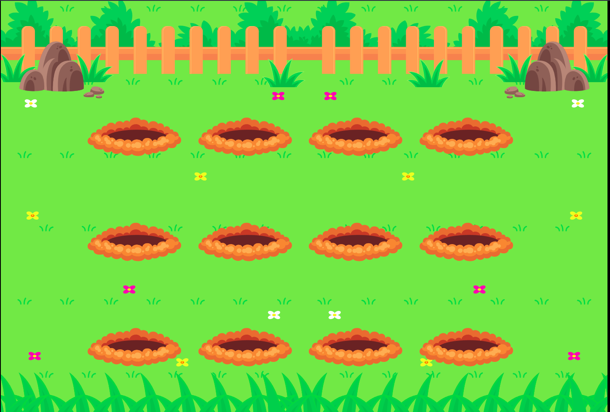

# SPA Universe

> Explorer - Stage 3

Conceitos de HTML e CSS aplicados na pratica.  

Projeto construído no curso Explorer da Rocketseat Stage 3.

[Clique aqui para acessar](https://andreliciosantos.github.io/Wack_a_Mole/)

## 🛠 Tecnologias 

- HTML
- CSS
- Git e Github 

## 💛 Contato

andreliciosantos@gmail.com  
[Linkedin](www.linkedin.com/in/andreliciosantos)  
[Instagram](https://www.instagram.com/andreliciosantos/)